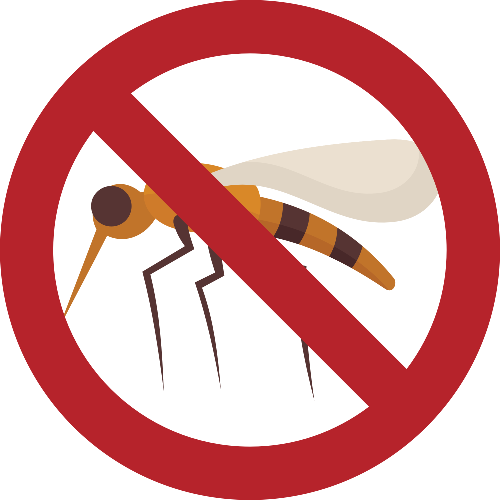

# Dengue Checker 🦟

<div align="center">
  
  
  <p><strong>Sistem Deteksi Dini Demam Berdarah Dengue Berbasis AI</strong></p>
  
  <p>Aplikasi web inovatif untuk membantu deteksi dini DBD menggunakan teknologi Machine Learning</p>

  [](https://nextjs.org/)
  [](https://www.typescriptlang.org/)
  [](https://supabase.com/)
  [](LICENSE)
</div>

---

## 📖 Tentang Aplikasi

**Dengue Checker** adalah aplikasi web yang dirancang untuk membantu masyarakat Indonesia melakukan deteksi dini Demam Berdarah Dengue (DBD) secara mandiri. Dengan memanfaatkan algoritma Machine Learning seperti **Logistic Regression** dan **Support Vector Machine (SVM)**, aplikasi ini dapat memprediksi kemungkinan seseorang terkena DBD berdasarkan gejala klinis dan hasil laboratorium.

### 🎯 Manfaat Aplikasi

#### Untuk Masyarakat Umum:
- ✅ **Deteksi Dini**: Identifikasi risiko DBD sejak gejala awal muncul
- ✅ **Mudah Digunakan**: Interface yang user-friendly dan interaktif
- ✅ **Tanpa Biaya**: Gratis dan dapat diakses kapan saja, dimana saja
- ✅ **Privasi Terjamin**: Pemeriksaan anonim tanpa harus login
- ✅ **Edukasi Kesehatan**: Informasi lengkap tentang DBD dan pencegahannya

#### Untuk Tenaga Kesehatan:
- 📊 **Data Visual**: Peta sebaran kasus DBD di Indonesia
- 🔍 **Screening Awal**: Membantu triase pasien sebelum pemeriksaan mendalam
- 📱 **Akses Cepat**: Dapat digunakan untuk konsultasi online

#### Untuk Peneliti:
- 📈 **Pattern Recognition**: Analisis pola gejala DBD
- 🧪 **Validasi Model**: Platform untuk testing model ML berbeda
- 📊 **Data Insights**: Visualisasi data kasus DBD

---

## ✨ Fitur Utama

### 🎯 Prediksi Berbasis AI
- Menggunakan algoritma Logistic Regression dan SVM
- Akurasi tinggi berdasarkan dataset klinis
- Prediksi real-time dan instan

### 📋 Form Interaktif Multi-Step
- **Step 1**: Data Pribadi & Gejala Utama (demam, suhu, durasi)
- **Step 2**: Gejala Tambahan (8 gejala klinis)
- **Step 3**: Hasil Uji Laboratorium (WBC, Hemoglobin, Hematokrit, Platelet)
- Progress indicator untuk tracking pengisian

### 📊 Visualisasi Data
- Peta interaktif sebaran kasus DBD di Indonesia
- Heatmap geografis dengan Leaflet & Plotly
- Real-time data visualization

### 👤 Sistem Autentikasi
- Login dengan email/password atau Google OAuth
- Riwayat pemeriksaan tersimpan untuk user terdaftar
- Mode anonim untuk privasi maksimal

### 📁 Riwayat Pemeriksaan
- Simpan semua hasil pemeriksaan
- Download hasil dalam format PDF/Image
- Monitoring kesehatan dari waktu ke waktu

### 📱 Responsive Design
- Optimal di desktop, tablet, dan mobile
- Interface adaptif untuk semua ukuran layar
- Fast loading dan smooth navigation

---

## 🚀 Instalasi & Setup

### Prasyarat

Pastikan Anda sudah menginstal:
- **Bun** (Package Manager) - [Download](https://bun.sh/)
- **Git** - [Download](https://git-scm.com/)
- **Akun Supabase** (gratis) - [Sign Up](https://supabase.com/)

### Langkah 1: Clone Repository

```bash
git clone https://github.com/aliepratama/dengue-checker-nextjs.git
cd dengue-checker-nextjs
```

### Langkah 2: Install Dependencies

```bash
bun install
```

### Langkah 3: Setup Supabase

#### 3.1 Buat Project Supabase

1. Buka [Supabase Dashboard](https://app.supabase.com/)
2. Klik **"New Project"**
3. Isi nama project, password database, dan pilih region (Southeast Asia untuk Indonesia)
4. Tunggu setup selesai (~2 menit)

#### 3.2 Aktifkan Google OAuth (Opsional)

Untuk fitur login dengan Google:

1. Buka project Anda di Supabase Dashboard
2. Navigasi ke **Authentication** → **Providers**
3. Enable **Google** provider
4. Dapatkan Google OAuth credentials:
   - Buka [Google Cloud Console](https://console.cloud.google.com/)
   - Buat OAuth 2.0 Client ID
   - Tambahkan redirect URI: `https://[PROJECT-ID].supabase.co/auth/v1/callback`
5. Paste Client ID dan Secret ke Supabase

#### 3.3 Setup Database Tables

Jalankan SQL berikut di Supabase SQL Editor:

```sql
-- Table untuk menyimpan profil user
CREATE TABLE user_profiles (
  id UUID REFERENCES auth.users ON DELETE CASCADE PRIMARY KEY,
  full_name TEXT,
  created_at TIMESTAMP WITH TIME ZONE DEFAULT TIMEZONE('utc'::text, NOW())
);

-- Table untuk menyimpan riwayat pemeriksaan
CREATE TABLE examinations (
  id UUID DEFAULT gen_random_uuid() PRIMARY KEY,
  user_id UUID REFERENCES auth.users ON DELETE CASCADE,
  form_data JSONB NOT NULL,
  prediction INTEGER NOT NULL,
  probability FLOAT,
  created_at TIMESTAMP WITH TIME ZONE DEFAULT TIMEZONE('utc'::text, NOW())
);

-- Enable Row Level Security
ALTER TABLE user_profiles ENABLE ROW LEVEL SECURITY;
ALTER TABLE examinations ENABLE ROW LEVEL SECURITY;

-- Policies untuk user_profiles
CREATE POLICY "Users can view own profile"
  ON user_profiles FOR SELECT
  USING (auth.uid() = id);

CREATE POLICY "Users can update own profile"
  ON user_profiles FOR UPDATE
  USING (auth.uid() = id);

-- Policies untuk examinations
CREATE POLICY "Users can view own examinations"
  ON examinations FOR SELECT
  USING (auth.uid() = user_id);

CREATE POLICY "Users can create examinations"
  ON examinations FOR INSERT
  WITH CHECK (auth.uid() = user_id);
```

### Langkah 4: Konfigurasi Environment Variables

1. Salin file environment template:
   ```bash
   cp .env.local.example .env.local
   ```

2. Buka `.env.local` dan isi dengan credentials Supabase Anda:
   ```env
   NEXT_PUBLIC_SUPABASE_URL=https://your-project-id.supabase.co
   NEXT_PUBLIC_SUPABASE_ANON_KEY=your-anon-key-here
   ```

3. Cara mendapatkan credentials:
   - Buka Supabase Dashboard
   - Pilih project Anda
   - Navigasi ke **Settings** → **API**
   - Copy **Project URL** dan **anon public** key

### Langkah 5: Jalankan Aplikasi

#### Development Mode:
```bash
bun dev
```

Aplikasi akan berjalan di: **http://localhost:3000**

#### Production Build:
```bash
# Build aplikasi
bun run build

# Jalankan production server
bun start
```

---

## 📱 Cara Menggunakan

### Untuk User Baru (Tanpa Login)

1. **Akses Homepage**
   - Buka http://localhost:3000
   - Lihat peta sebaran DBD di Indonesia
   - Klik tombol **"Periksa"**

2. **Isi Formulir Pemeriksaan**
   - **Step 1**: Isi data pribadi, gejala demam, dan suhu tubuh
   - **Step 2**: Centang gejala tambahan yang dialami
   - **Step 3**: Isi hasil uji laboratorium (jika ada)
   - Klik **"Submit"** untuk mendapatkan hasil

3. **Lihat Hasil Prediksi**
   - Lihat status: **Positif DBD** atau **Negatif DBD**
   - Baca rekomendasi tindakan
   - Download hasil untuk dibawa ke dokter

### Untuk User Terdaftar

1. **Daftar/Login**
   - Klik **"Masuk"** di navbar
   - Pilih **"Daftar"** untuk akun baru
   - Atau login dengan **Google**

2. **Lakukan Pemeriksaan**
   - Sama seperti user tanpa login
   - Hasil otomatis tersimpan di riwayat

3. **Akses Riwayat**
   - Klik menu **"Riwayat"**
   - Lihat semua pemeriksaan sebelumnya
   - Download atau lihat detail hasil lama

---

## 🛠️ Tech Stack

| Kategori | Teknologi |
|----------|-----------|
| **Framework** | Next.js 15 (App Router) |
| **Language** | TypeScript |
| **Styling** | Tailwind CSS 4 |
| **Authentication** | Supabase Auth |
| **Database** | Supabase (PostgreSQL) |
| **Maps** | Leaflet, Plotly.js |
| **Machine Learning** | Logistic Regression, SVM |
| **Package Manager** | Bun |
| **Deployment** | Vercel (recommended) |

---

## 📂 Struktur Project

```
dengue-checker-nextjs/
├── app/                          # Next.js App Router
│   ├── components/               # Reusable components
│   │   ├── Navbar.tsx           # Navigation bar
│   │   ├── Stepper.tsx          # Progress indicator
│   │   ├── InputChoice.tsx      # Checkbox group input
│   │   ├── InputNum.tsx         # Number input
│   │   ├── Question.tsx         # Question wrapper
│   │   ├── LeafletMap.tsx       # Map component
│   │   └── ...
│   ├── about/                    # About page
│   ├── form/                     # Multi-step form
│   ├── history/                  # Examination history
│   ├── login/                    # Login page
│   ├── register/                 # Register page
│   ├── result/                   # Result page
│   ├── page.tsx                  # Homepage
│   ├── layout.tsx                # Root layout
│   └── not-found.tsx             # 404 page
├── lib/                          # Utilities & logic
│   ├── model.ts                  # ML models & prediction
│   └── dengue-service.ts         # Supabase services
├── utils/                        # Utility functions
│   └── supabase/                 # Supabase clients
├── public/                       # Static assets
│   ├── images/                   # Images
│   ├── icons/                    # SVG icons
│   └── heatmap_geo.json         # Map data
├── types/                        # TypeScript types
├── .env.local                    # Environment variables (create this)
└── package.json                  # Dependencies
```

---

## 🤝 Kontribusi

Kami menerima kontribusi dari siapa saja! Jika Anda ingin berkontribusi:

1. Fork repository ini
2. Buat branch baru (`git checkout -b feature/AmazingFeature`)
3. Commit perubahan (`git commit -m 'Add some AmazingFeature'`)
4. Push ke branch (`git push origin feature/AmazingFeature`)
5. Buat Pull Request

---

## 📄 Lisensi

Project ini dilisensikan di bawah MIT License - lihat file [LICENSE](LICENSE) untuk detail.

---

## 👥 Tim Pengembang

Dibuat oleh mahasiswa Universitas Teknologi Yogyakarta:

- **Alie Pratama** - Full Stack Developer
- **Zakki Farian** - Machine Learning Engineer  
- **Ridho Lestari** - UI/UX Designer & Developer

---

## ⚠️ Disclaimer

Aplikasi ini **BUKAN** pengganti diagnosis medis profesional. Hasil prediksi hanya sebagai **screening awal** dan **referensi**. Selalu konsultasikan dengan dokter atau tenaga kesehatan untuk diagnosis dan pengobatan yang tepat.

---

## 🙏 Acknowledgments

- [Next.js](https://nextjs.org/) - The React Framework
- [Supabase](https://supabase.com/) - Open Source Firebase Alternative
- [Tailwind CSS](https://tailwindcss.com/) - Utility-first CSS framework
- [Leaflet](https://leafletjs.com/) - Open-source JavaScript library for maps
- [WHO](https://www.who.int/) - Dengue data and guidelines
- [Kemenkes RI](https://www.kemkes.go.id/) - Indonesian health data

---

<div align="center">
  <p>Made with ❤️ for Indonesian Healthcare</p>
  <p>© 2025 Dengue Checker - Universitas Teknologi Yogyakarta</p>
</div>
